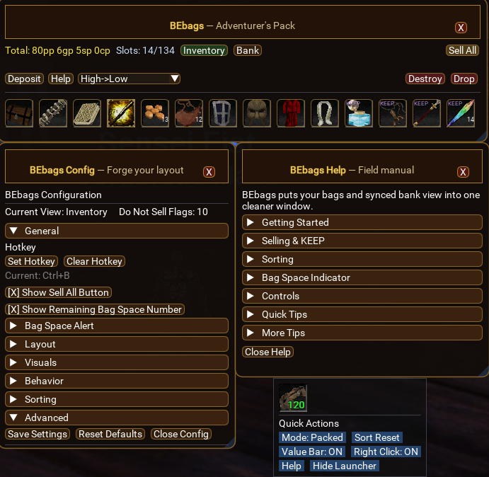

<p align="center">
  <strong>Download</strong>
</p>

<p align="center">
  👉 <a href="https://github.com/BlackeagleEQ/BEbags/releases/latest">Download Latest Version</a> 👈
</p>

<p align="center">
  <a href="https://github.com/BlackeagleEQ/BEbags/releases/latest">
    
  </a>
</p>

# 👜 BEbags

**BEbags** is a powerful inventory manager for **EQEmu Servers using MacroQuest / E3N** that combines all your bags into one clean, easy-to-use interface.

No more opening bags one by one — everything is in one place.


# ✨ Key Features

* 📦 Combines all bags into a single window
* 🏦 View your bank anywhere after syncing
* ⚡ Quick actions: deposit, destroy, drop
* 💰 Value-based item highlighting
* 🖱️ Smart click interactions
* 🎨 Multiple UI themes
* ⚙️ Fully customizable layout & behavior


# 🆕 New in v1.2.1

## 📁 Config System Upgrade

BEbags now stores all config and cache files in:

```
e3\config\BEbags\
```

### Benefits

* Keeps your config folder clean
* No startup lag
* Automatically created when settings are saved

> ⚠️ Existing users will generate new config files after updating.


## 🎒 Bag Space Indicator (Launcher Overlay)

A fully customizable indicator showing remaining bag space:

* Toggle visibility on/off
* Adjustable size (Small / Medium / Large)
* Style options (Clean / Bold)
* Outline options (Off / Light / Heavy)
* Multiple positions (center + corners)
* Fine-tune with X/Y offsets
* Color thresholds based on % of free space


## 🧠 UI & Help Improvements

* Reworked **Field Manual (Help Menu)**:

  * Collapsible sections
  * Quick Tips for faster onboarding
  * Cleaner layout

* Improved config window:

  * Better spacing and grouping
  * Reduced clutter


# 🔄 Sorting System

Items can be sorted using the dropdown:

* Bag Order
* High → Low (most valuable first)
* Low → High
* Name A → Z
* Name Z → A

👉 **Sell All uses the current sort order**


# 💰 Sell All System

* Sells all items worth **≥ 1pp**
* Works only when a merchant is open
* Processes items in **current sort order**
* Skips all **KEEP items**
* Handles full stacks automatically


# 🛡️ KEEP System

* Toggle KEEP:

  * **Alt + Right Click**

KEEP items:

* ❌ Never sold
* ❌ Do NOT glow
* ✅ Pushed to end of sorts

Removing KEEP restores normal behavior.


## 💰 Value Highlight System

BEbags automatically highlights items based on vendor value:

- 🟡 **Gold** → ≥ 100pp (high value)  
- 🟢 **Green** → ≥ 10pp (moderate value)  
- ⚫ **Default** → Low value / vendor trash  
- 🏷️ **KEEP** → Protected (no glow)

👉 Use this with **Value sorting** to quickly identify what to sell.


# 🖼️ Screenshots

### BEbags - Inventory Management




# 🚀 Installation

1. Download this repository or the latest release
2. Place `BEbags-version` folder into:

```
MacroQuest/lua/
```

3. Rename folder to `BEbags` if needed
4. In game:

```
/lua run BEbags
```


# 🎮 How It Works

## 👜 Main Window

* Displays all inventory items in one place
* Top bar includes:

  * Inventory / Bank / Deposit
  * Help button
  * Destroy / Drop (right side)


## 🖱️ Mouse Controls

- **Left Click** → Pick up / move item  
- **Double Left Click** → Inspect item  
- **Right Click** → Use item  
- **Ctrl + Right Click** → Sell full stack (merchant required)  
- **Alt + Right Click** → Toggle KEEP  
- **Middle Click** → Open quick actions  


# ⚡ Quick Actions

Access via middle-click:

* Toggle packed mode
* Reset sorting
* Toggle value bar
* Open help
* Hide launcher


# ⚠️ Safe vs Dangerous Actions

### Safe Actions

* Inventory
* Bank
* Deposit
* Help

### Dangerous Actions (right side)

* Destroy → permanently deletes item
* Drop → places item on the ground

👉 Separated to prevent misclicks.


# ⚙️ Configuration

Open config via:

```
/BEbags config
```

Or right-click the launcher icon.

Customize:

* Layout & sizing
* UI elements
* Feature toggles
* Themes
* Bag space indicator


# 🎨 Theme Presets

* Classic
* Diablo
* Emerald
* Frost


# 🏦 Bank System

* Open banker once to sync
* Access bank anywhere afterward

### Behavior

* Bank open → live view
* Bank closed → cached snapshot


# 💡 Pro Tips

* 🔥 Use Packed Mode for a cleaner view
* 💰 Sort by Value before selling
* 🏷️ Mark important items as KEEP
* ⚡ Deposit to quickly organize items
* 🏦 Sync bank once for global access
* 🎨 Try themes to match your style


# 📜 Commands

```
/BEbags           → Toggle main window
/BEbags config    → Open config
/BEbags help      → Open help menu
/BEbags destroy   → Destroy item on cursor
/BEbags drop      → Drop item on ground
```


# 👤 Author

BlackeagleEQ


# ❤️ Credits

Built for the AscendantEQ community using MacroQuest Lua.


# 🔥 Why BEbags?

Because once you use it, you’ll never go back to opening bags manually again.
