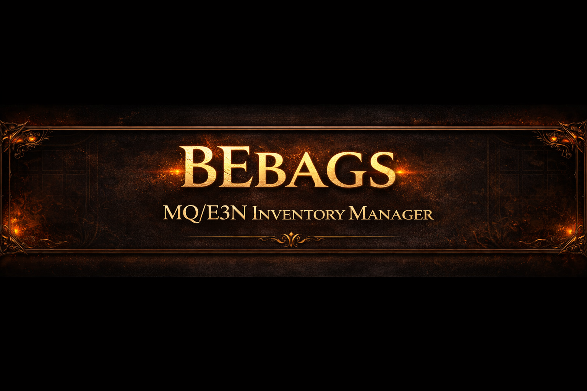
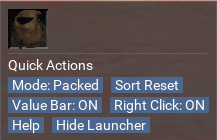
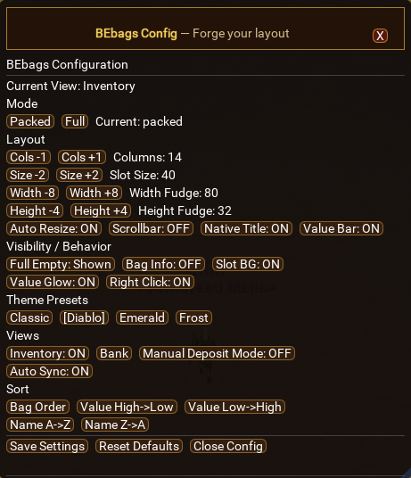
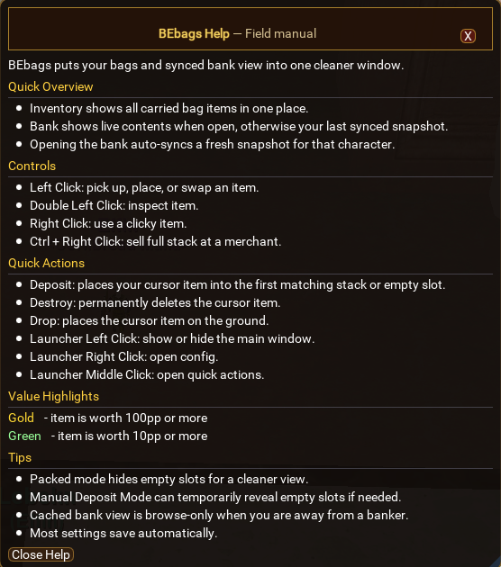
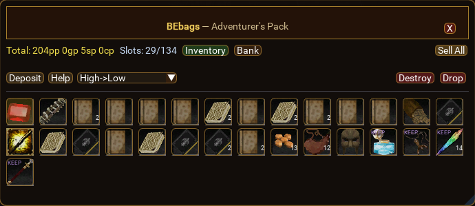

<p align="center">
  <strong>Download</strong>
</p>

<p align="center">
  👉 <a href="https://github.com/BlackeagleEQ/BEbags/releases/latest">Download Latest Version</a> 👈
</p>

# 👜 BEbags

**BEbags** is a powerful inventory manager for **EQEmu Servers using MacroQuest / E3N** that combines all your bags into one clean, easy-to-use interface.

No more opening bags one by one. Everything is in one place.

---

## ✨ What It Does

* 📦 Combines all your bags into a single window
* 🏦 Lets you view your bank anywhere after syncing
* ⚡ Adds quick actions like deposit, destroy, and drop
* 🎯 Highlights valuable items automatically
* 🖱️ Improves item interaction with smart click behavior
* 🎨 Includes multiple UI themes
* ⚙️ Fully customizable layout and behavior

---

## 🖼️ Screenshots

### Quick Actions Menu



### Configuration Menu



### Help / Field Manual



### Inventory / Adventurer's Pack



---

## 🚀 Installation

1. Download this repository or the latest release
2. Place `BEbags.lua` into your MacroQuest `lua` folder:

```
MacroQuest/lua/BEbags.lua
```

3. In game, run:

```
/lua run BEbags
```

---

## 🎮 How It Works

### 👜 Main Window

* Displays all items from your inventory in one place
* Top bar includes:

  * **Inventory / Bank / Deposit**
  * **Help button (quick access to field manual)**
  * **Destroy / Drop (danger actions on the right)**

---

## 💰 Value Highlight System

BEbags automatically highlights items based on their vendor value:

| Color     | Meaning                     |
| --------- | --------------------------- |
| 🟡 Gold   | **≥ 100pp** (high value)    |
| 🟢 Green  | **≥ 10pp** (moderate value) |
| ⚫ Default | Low value / vendor trash    |

👉 Use this with **Value sorting** to quickly identify what to sell or keep.

---

## 🖱️ Mouse Controls

| Action              | Result                              |
| ------------------- | ----------------------------------- |
| Left Click          | Pick up / move item                 |
| Double Left Click   | Inspect item                        |
| Right Click         | Use item                            |
| Ctrl + Right Click  | Sell full stack (merchant required) |
| Middle Click (icon) | Open quick actions                  |

---

## ⚡ Quick Actions

Accessed via middle-click on the launcher icon:

* Toggle packed mode
* Reset sorting
* Toggle value bar
* Open help
* Hide launcher

---

## ⚠️ Safe vs Dangerous Actions

BEbags separates actions to prevent mistakes:

### Safe Actions

* Inventory
* Bank
* Deposit
* Help

### Dangerous Actions (right side, red)

* Destroy → permanently deletes item
* Drop → places item on the ground

👉 These are intentionally separated to reduce misclick risk.

---

## ⚙️ Configuration

Open config by:

* Right-clicking the launcher icon
* Or using:

```
/BEbags config
```

From here you can:

* Adjust layout and sizing
* Toggle UI elements
* Enable/disable features
* Choose your theme

---

## 🎨 Theme Presets

* Classic
* Diablo
* Emerald
* Frost

---

## 🏦 Bank System

* Open a banker once to sync your bank
* After syncing, you can view your bank anywhere

### Behavior:

* Bank open → live view
* Bank closed → cached snapshot (character-specific)

---

## 💡 Pro Tips

* 🔥 Use Packed Mode
  Keeps your inventory clean and compact

* 💰 Use Value Highlights
  Green and gold items are your money makers

* ⚡ Deposit is your best friend
  Quickly stacks items or fills empty slots

* 🧹 Clean junk instantly
  Use Destroy / Drop for low-value items

* 🏦 Bank anywhere
  Sync once, access anytime

* 🎯 Sort before selling
  Value sorting makes selling much faster

* 🎨 Try themes
  Diablo = high contrast
  Emerald = easy on the eyes
  Frost = clean and minimal

---

## 📜 Commands

```
/BEbags           → Toggle main window
/BEbags config    → Open config
/BEbags help      → Open help menu
/BEbags destroy   → Destroy item on cursor
/BEbags drop      → Drop item on ground
```

---

## 👤 Author

BlackeagleEQ

---

## ❤️ Credits

Built for the AscendantEQ community using MacroQuest Lua.

---

## 🔥 Why BEbags?

Because once you use it, you’ll never go back to opening bags manually again.
